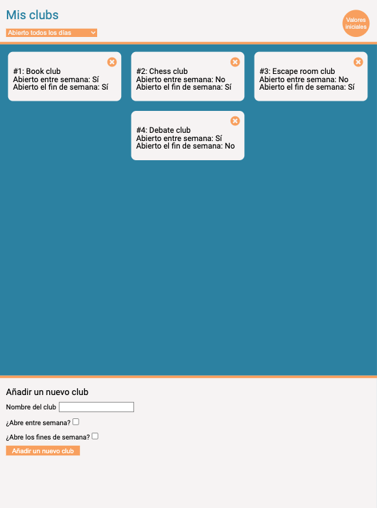

# Ejercicio React

Este ejercicio consiste en crear un organizador personal de clubs. Está creado sobre el React Starter Kit de Adalab.
Puedes añadir nuevos clubs con su fecha de apertura, borrarlos y volver a los valores iniciales.

Esta es la apariencia de la web:



### Estructura del proyecto

Esta es la estructura de carpetas:

```
src
 ├── components
 |  └── App.js
 |
 ├── data
 |	└── clubs.json
 |
 ├── images
 |
 ├── styles
 |
 ├── index.js


```

### Tecnologías y recursos utilizados para el proyecto:

- HTML y preprocesador SASS con sintaxis SCSS
- Node.js
- Markdown
- Gulp
- Javascript
- React
